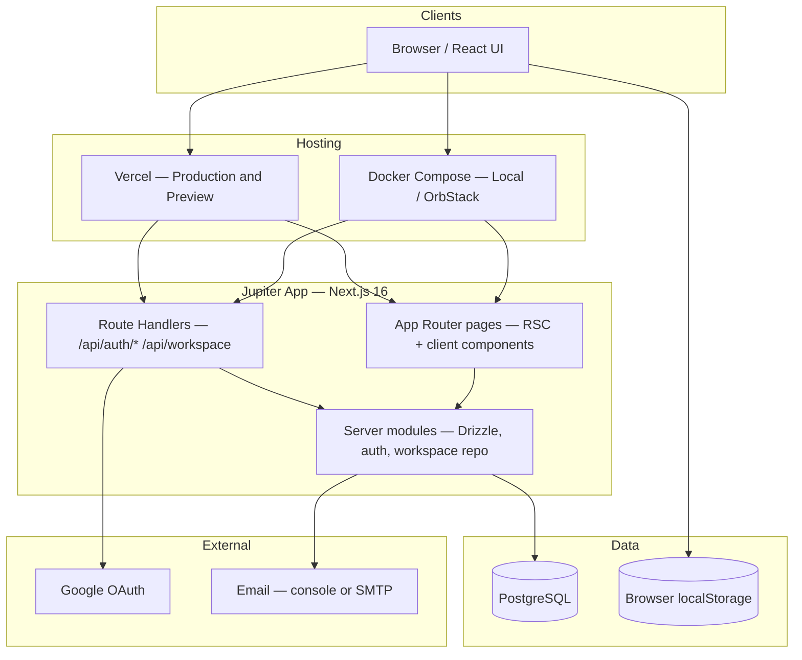
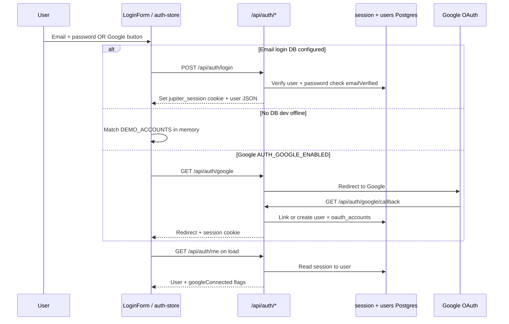
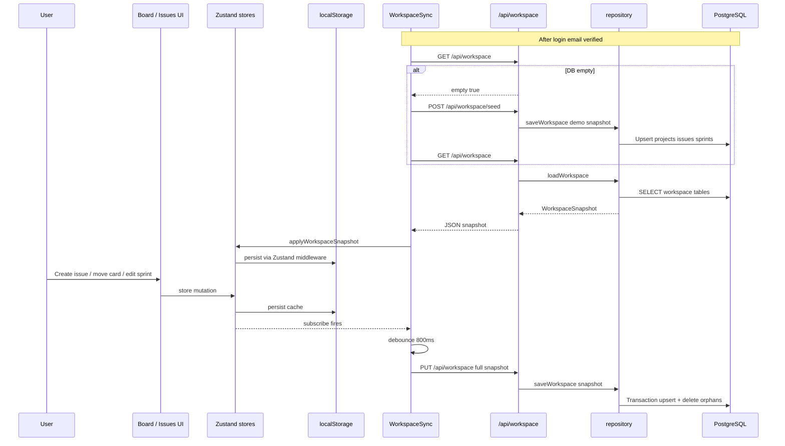
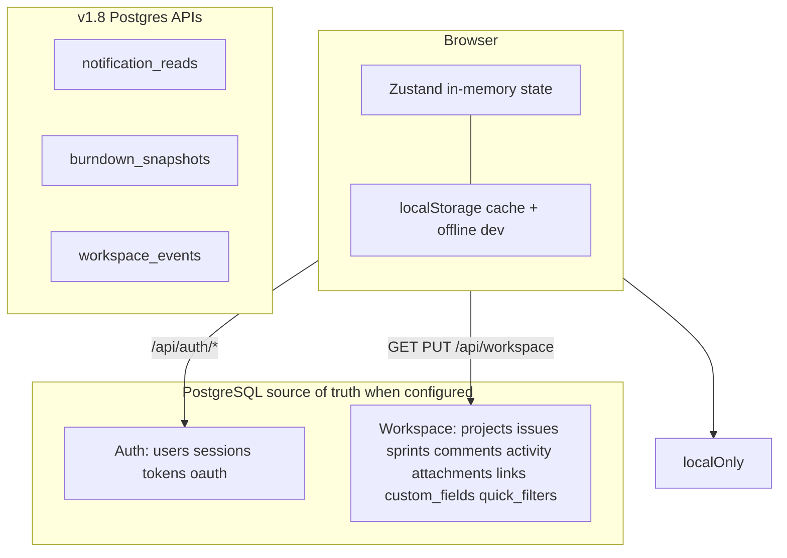
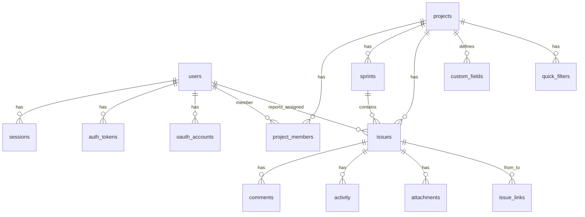
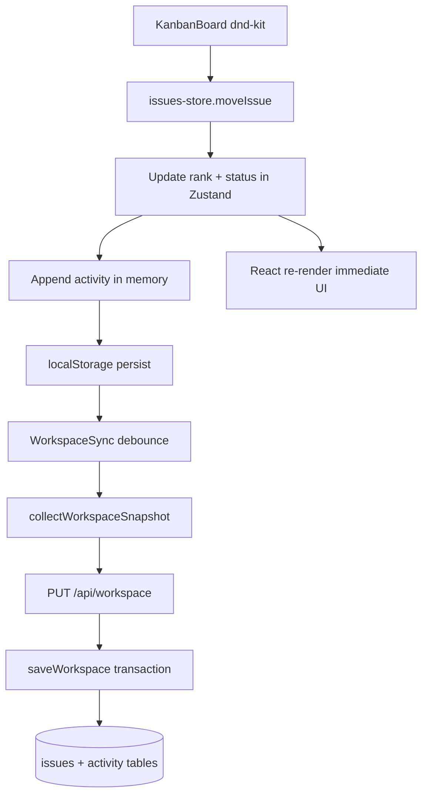

# Jupiter — System architecture & data flow

High-level view of how the app is deployed, how layers interact, and where data is stored. For table-level detail see **[DATABASE.md](./DATABASE.md)**.

---

## 1. Deployment architecture

Jupiter is a **single Next.js 16 monolith** with two common runtimes and optional PostgreSQL.



| Environment | Build command | Database | Typical URL |
|-------------|---------------|----------|-------------|
| **Vercel** | `next build` via `npm run build` | Managed Postgres (`POSTGRES_URL`) | Production alias (e.g. `v0-jupiter.vercel.app`) |
| **Docker** | `next build` inside image | Postgres service in `docker-compose.yml` | `http://localhost:3100` |
| **Dev (no DB)** | `npm run dev` | None — client-only demo auth | `http://localhost:3100` |

**Env resolution:** the server reads `DATABASE_URL` or Vercel’s `POSTGRES_URL` (see `src/server/env.ts`). `APP_URL` / `VERCEL_PROJECT_PRODUCTION_URL` drive OAuth redirects and email links.

---

## 2. Application layers

```mermaid
flowchart LR
  subgraph ui [UI layer — client]
    Views[Pages: board, backlog, list, calendar, settings]
    Components[shadcn/ui components]
    Stores[Zustand stores]
    WS[WorkspaceSync]
  end

  subgraph api [API layer — server]
    AuthRoutes[/api/auth/*]
    WorkspaceRoutes[/api/workspace]
  end

  subgraph domain [Domain / persistence]
    Mappers[DB mappers]
    Repo[workspace/repository]
    AuthSvc[auth: session, tokens, Google]
    Drizzle[Drizzle ORM]
  end

  Views --> Components
  Components --> Stores
  WS --> Stores
  WS --> WorkspaceRoutes
  Views --> AuthRoutes
  Stores --> Components
  WorkspaceRoutes --> Repo
  AuthRoutes --> AuthSvc
  Repo --> Mappers
  Repo --> Drizzle
  AuthSvc --> Drizzle
  Drizzle --> PG[(PostgreSQL)]
```

### Zustand stores (workspace)

| Store | Responsibility |
|-------|----------------|
| `projects-store` | Projects, members |
| `issues-store` | Issues, comments, activity, attachments |
| `sprints-store` | Sprints (burndown snapshots stay local-only) |
| `issue-links-store` | Directed issue relationships |
| `custom-fields-store` | Per-project field definitions |
| `quick-filters-store` | Saved board/backlog filter chips |
| `auth-store` | Current user + session hydration |

### Key server modules

| Path | Role |
|------|------|
| `src/server/db/schema.ts` | Drizzle table definitions |
| `src/server/db/mappers.ts` | Row ↔ client type mapping |
| `src/server/workspace/repository.ts` | `loadWorkspace` / `saveWorkspace` |
| `src/server/auth/*` | Login, register, Google, sessions |
| `src/components/workspace/workspace-sync.tsx` | Hydrate + debounced PUT sync |

---

## 3. Auth data flow (v1.6 / v1.7)



**Postgres tables (auth):** `users`, `sessions`, `auth_tokens`, `oauth_accounts`

---

## 4. Workspace data flow (Postgres sync)

When Postgres is configured, tracker data is the **source of truth** in the database; the UI still updates **Zustand first** for responsiveness.



**API contract**

| Method | Path | Purpose |
|--------|------|---------|
| `GET` | `/api/workspace` | Full snapshot, or `{ empty: true }` |
| `PUT` | `/api/workspace` | Upsert snapshot from client stores |
| `POST` | `/api/workspace/seed` | Demo data (any user if empty; admin if not) |

**Design note:** sync uses a **full snapshot** PUT (simple for demo/small teams), not per-resource REST yet. The UI updates immediately; Postgres catches up after ~800ms debounce.

---

## 5. Storage map — what lives where



---

## 6. Database entity model



Column-level notes: **[DATABASE.md](./DATABASE.md)**.

---

## 7. Example request path — move issue on board



---

## 8. Mental model

1. **UI is client-first** — React reads/writes Zustand; `localStorage` caches state for fast reload and offline dev.
2. **Auth is server-authoritative** when Postgres exists — cookie session, email/Google flows, no secrets in the bundle.
3. **Workspace sync is snapshot-based** — load once after login; debounced PUT keeps Postgres aligned with stores.
4. **v1.8 APIs** — `notification_reads`, `burndown_snapshots`, and `workspace_events` sync via targeted routes (see [v1.8-persistence-requirements.md](./v1.8-persistence-requirements.md)).

---

## Related docs

- [DATABASE.md](./DATABASE.md) — tables, columns, seed commands
- [v1.6-auth-requirements.md](./v1.6-auth-requirements.md) — email auth
- [v1.7-google-sign-in-requirements.md](./v1.7-google-sign-in-requirements.md) — Google OAuth
- [v1.8-persistence-requirements.md](./v1.8-persistence-requirements.md) — notifications, audit API, burndown tables
- [../README.md](../README.md) — runbooks (Vercel, Docker, demo accounts)
