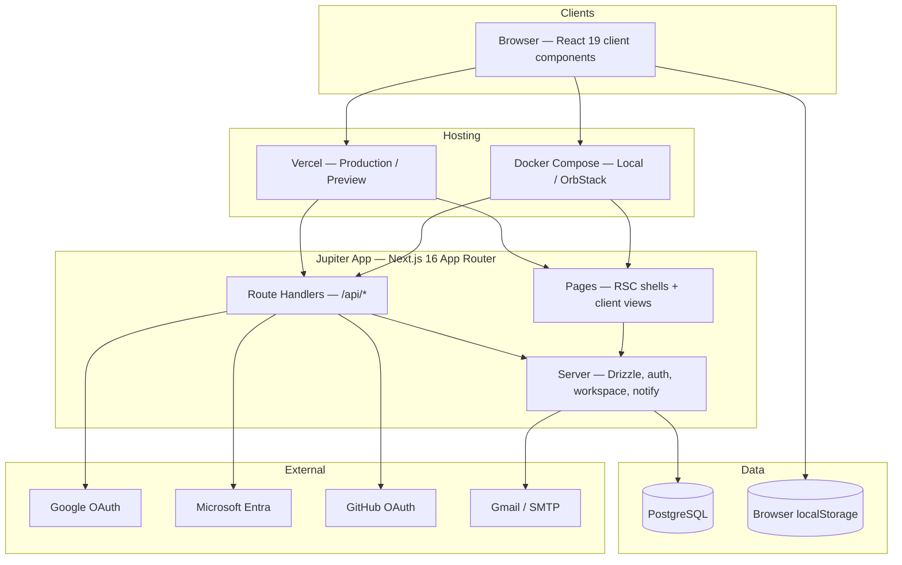
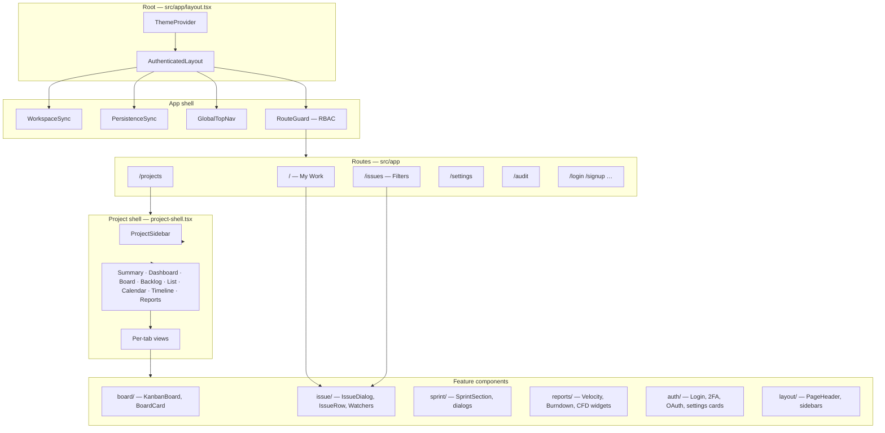
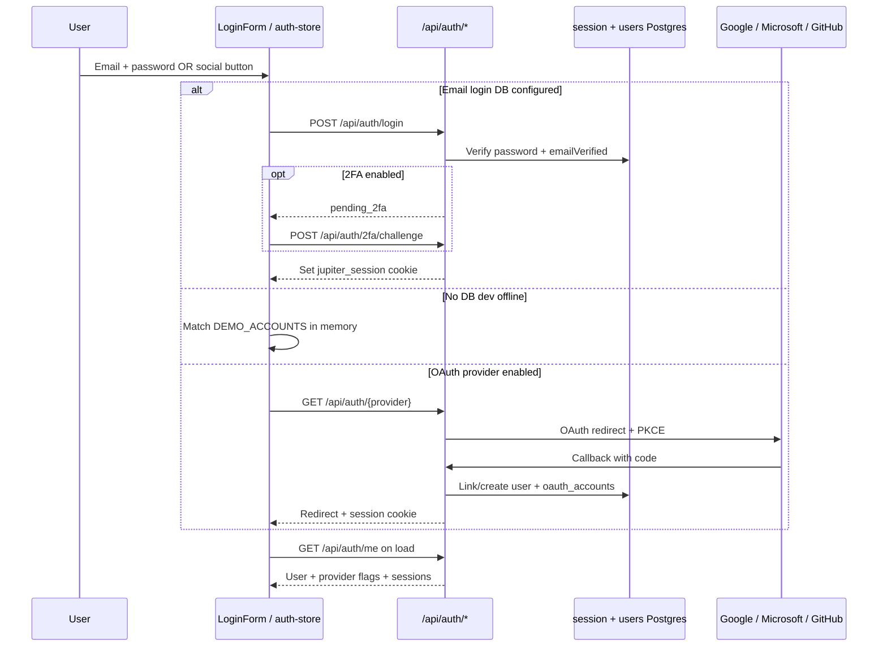
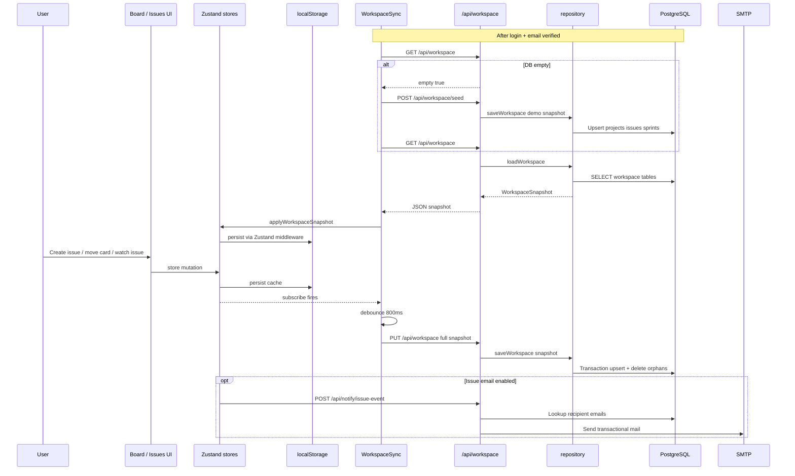
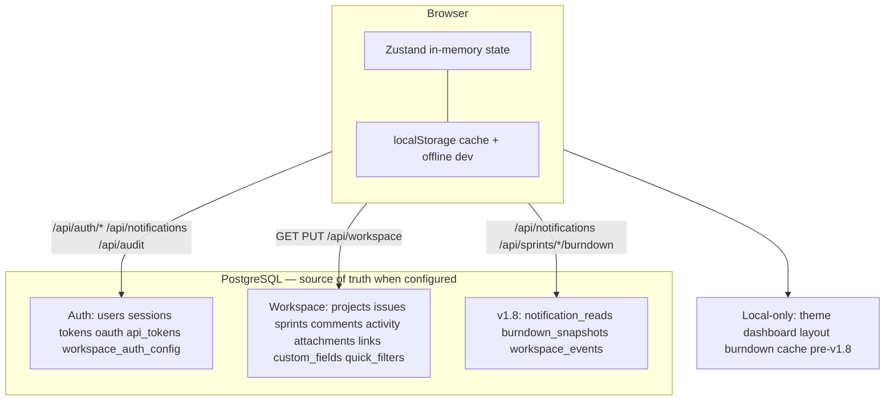
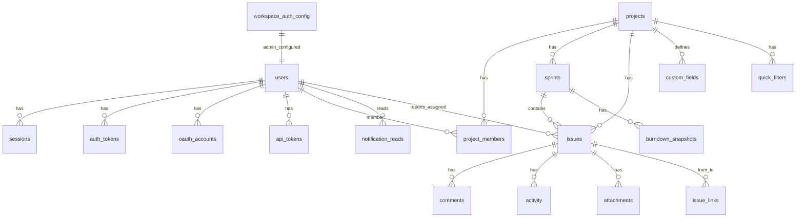
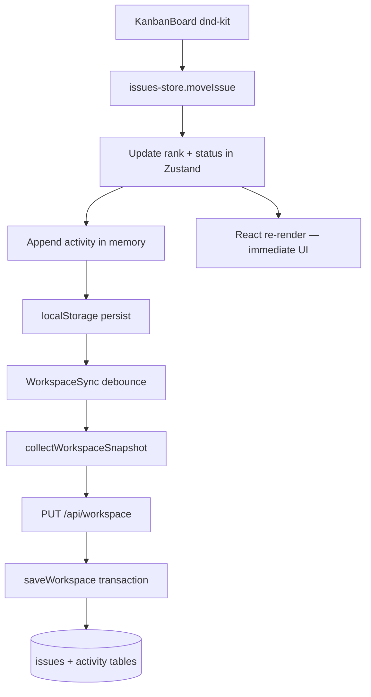
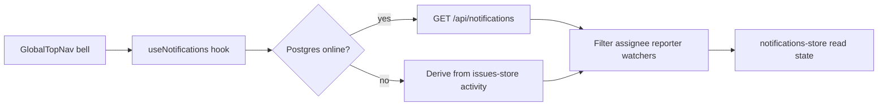

# Jupiter — System architecture & data flow

High-level view of how the app is deployed, how layers interact, where data is stored, and how UI components are organized. For table-level detail see **[DATABASE.md](./DATABASE.md)**.

**Release:** v1.13 · Last updated: June 2026

---

## 1. Deployment architecture

Jupiter is a **single Next.js 16 monolith** with two common runtimes and optional PostgreSQL.



| Environment | Build command | Database | Typical URL |
|-------------|---------------|----------|-------------|
| **Vercel** | `next build` via `npm run build` | Managed Postgres (`POSTGRES_URL`) | Production alias (e.g. `v0-jupiter.vercel.app`) |
| **Docker** | `next build` inside image | Postgres service in `docker-compose.yml` | `http://localhost:3100` |
| **Dev (no DB)** | `npm run dev` | None — client-only demo auth | `http://localhost:3100` |

**Env resolution:** the server reads `DATABASE_URL` or Vercel’s `POSTGRES_URL` (see `src/server/env.ts`). `APP_URL` drives OAuth redirects and email links. `ISSUE_EMAIL_NOTIFICATIONS=true` enables issue event mail (v1.9).

---

## 2. Application layers (standard for this app)

```mermaid
flowchart TB
  subgraph ui [UI — client only]
    Pages[App Router pages]
    Feature[Feature components]
    UIKit[shadcn/ui primitives]
    Stores[Zustand stores]
    Derive[lib/derive — pure logic]
    Sync[WorkspaceSync + PersistenceSync]
  end

  subgraph api [API — Route Handlers]
    AuthAPI[/api/auth/*]
    WorkspaceAPI[/api/workspace]
    PersistAPI[/api/notifications /audit /burndown]
    NotifyAPI[/api/notify/issue-event]
    AdminAPI[/api/admin/*]
  end

  subgraph domain [Domain / server]
    Repo[workspace/repository]
    AuthSvc[server/auth/*]
    PersistSvc[server/persistence/*]
    NotifySvc[server/notify/*]
    Mappers[db/mappers]
    Drizzle[Drizzle ORM + schema]
  end

  Pages --> Feature
  Feature --> UIKit
  Feature --> Stores
  Feature --> Derive
  Sync --> Stores
  Sync --> WorkspaceAPI
  Sync --> PersistAPI
  Pages --> AuthAPI
  Stores --> Feature
  WorkspaceAPI --> Repo
  AuthAPI --> AuthSvc
  PersistAPI --> PersistSvc
  NotifyAPI --> NotifySvc
  Repo --> Mappers
  AuthSvc --> Drizzle
  PersistSvc --> Drizzle
  NotifySvc --> Drizzle
  Drizzle --> PG[(PostgreSQL)]
  Stores --> LS[(localStorage)]
```

### Standard patterns (one app, one stack)

| Pattern | Where | Rule |
|---------|-------|------|
| **Client-first UI** | All tracker views | Mutate Zustand → instant re-render; Postgres catches up async |
| **Snapshot sync** | `/api/workspace` | Full workspace PUT after debounce (~800ms), not per-field REST |
| **Targeted APIs** | v1.8+ | Notifications read-state, audit, burndown, workspace events — small HTTP routes |
| **Pure derive** | `src/lib/derive/*` | Reports, JQL helpers, watchers, due dates — no I/O, unit-tested |
| **Server auth** | `/api/auth/*` | Cookie session + optional Bearer PAT; never secrets in bundle |
| **RBAC** | `permissions.ts` | Role checks in UI (`RouteGuard`) and API (`requirePermission`) |
| **Offline dev** | No `POSTGRES_URL` | Demo accounts in memory; stores persist to `localStorage` only |

### Zustand stores

| Store | Responsibility |
|-------|----------------|
| `auth-store` | Session hydration, current user |
| `projects-store` | Projects, members |
| `issues-store` | Issues, comments, activity, attachments, watchers |
| `sprints-store` | Sprints |
| `issue-links-store` | Directed issue relationships |
| `custom-fields-store` | Per-project field definitions |
| `quick-filters-store` | Saved board/backlog filter chips |
| `notifications-store` | Read state + API feed cache |
| `dashboard-store` | Per-project dashboard widget layout (v1.9) |
| `theme-store` | Light/dark preference |

### Key server modules

| Path | Role |
|------|------|
| `src/server/db/schema.ts` | Drizzle table definitions |
| `src/server/db/mappers.ts` | Row ↔ client type mapping |
| `src/server/workspace/repository.ts` | `loadWorkspace` / `saveWorkspace` |
| `src/server/auth/*` | Login, OAuth, 2FA, sessions, PATs, settings |
| `src/server/persistence/*` | Notifications, audit, burndown snapshots |
| `src/server/notify/*` | Issue event email (v1.9) |
| `src/components/workspace/workspace-sync.tsx` | Hydrate + debounced PUT sync |
| `src/components/workspace/persistence-sync.tsx` | v1.8 API hydration |

---

## 3. Component architecture

Every authenticated screen shares one shell. Feature UI is grouped by domain under `src/components/`.



### Component map (by folder)

| Folder | Components | Consumes |
|--------|------------|----------|
| `layout/` | `AuthenticatedLayout`, `GlobalTopNav`, `ProjectSidebar`, `RouteGuard` | `auth-store`, `permissions` |
| `workspace/` | `WorkspaceSync`, `PersistenceSync` | All workspace stores, `/api/workspace` |
| `board/` | `KanbanBoard`, `BoardColumn`, `BoardCard` | `issues-store`, `@dnd-kit` |
| `issue/` | `IssueDialog`, `IssueRow`, `IssueWatchers`, filters | `issues-store`, `projects-store` |
| `sprint/` | `SprintSection`, sprint dialogs | `sprints-store`, `issues-store` |
| `reports/` | `report-widgets` (velocity, burndown, CFD) | `derive/report-metrics`, Recharts |
| `auth/` | Login, OAuth buttons, 2FA, sessions, PATs | `/api/auth/*` |
| `ui/` | shadcn primitives (Button, Dialog, Card, …) | Design tokens / Tailwind v4 |

### Page → store → API (read path)

```mermaid
flowchart LR
  subgraph page [Example: Kanban Board]
    KB[KanbanBoard]
  end

  subgraph stores [Stores]
    IS[issues-store]
    PS[projects-store]
    SS[sprints-store]
  end

  subgraph derive [Pure]
    WF[workflow-transitions]
  end

  KB --> IS
  KB --> PS
  KB --> WF
  IS -.->|subscribe| WS[WorkspaceSync]
  WS -->|PUT debounced| API[/api/workspace]
```

---

## 4. Auth data flow (v1.6 → v1.11)



**Postgres tables (auth):** `users`, `sessions`, `auth_tokens`, `oauth_accounts`, `api_tokens`, `workspace_auth_config`, TOTP columns on `users`

---

## 5. Workspace data flow (Postgres sync)

When Postgres is configured, tracker data is the **source of truth** in the database; the UI still updates **Zustand first** for responsiveness.



**API contract — workspace**

| Method | Path | Purpose |
|--------|------|---------|
| `GET` | `/api/workspace` | Full snapshot, or `{ empty: true }` |
| `PUT` | `/api/workspace` | Upsert snapshot from client stores |
| `POST` | `/api/workspace/seed` | Demo data (any user if empty; admin if not) |
| `POST` | `/api/workspace/events` | Workspace-level audit events |

**API contract — v1.8 persistence**

| Method | Path | Purpose |
|--------|------|---------|
| `GET` | `/api/notifications` | Activity feed + read state |
| `POST` | `/api/notifications/read` | Mark read |
| `GET` | `/api/audit` | Paginated audit log |
| `GET/PUT` | `/api/sprints/:id/burndown` | Burndown snapshots |

---

## 6. Storage map — what lives where



---

## 7. Database entity model



Column-level notes: **[DATABASE.md](./DATABASE.md)**.

---

## 8. Example request paths

### Move issue on board



### Notification bell (online)



---

## 9. Mental model

1. **UI is client-first** — React reads/writes Zustand; `localStorage` caches state for fast reload and offline dev.
2. **Auth is server-authoritative** when Postgres exists — cookie session, email/OAuth/2FA flows, no secrets in the bundle.
3. **Workspace sync is snapshot-based** — load once after login; debounced PUT keeps Postgres aligned with stores.
4. **v1.8+ targeted APIs** — notifications, audit, burndown, workspace events sync without bloating the snapshot.
5. **v1.12 watchers** — `watcher_ids` on issues; bell feed includes watchers (client + `/api/notifications`).
6. **v1.9 polish** — project dashboard widgets (local layout), CSV export, optional issue event email.

---

## Related docs

- [DATABASE.md](./DATABASE.md) — tables, columns, seed commands
- [v1.6-auth-requirements.md](./v1.6-auth-requirements.md) — email auth
- [v1.7-google-sign-in-requirements.md](./v1.7-google-sign-in-requirements.md) — Google OAuth
- [v1.8-persistence-requirements.md](./v1.8-persistence-requirements.md) — notifications, audit API, burndown tables
- [v1.9-dashboards-polish-requirements.md](./v1.9-dashboards-polish-requirements.md) — dashboards, CSV, email hooks
- [v1.10-auth-security-requirements.md](./v1.10-auth-security-requirements.md) — Gmail SMTP mail + TOTP 2FA
- [v1.12-watchers-requirements.md](./v1.12-watchers-requirements.md) — issue watchers
- [../README.md](../README.md) — runbooks (Vercel, Docker, demo accounts)
