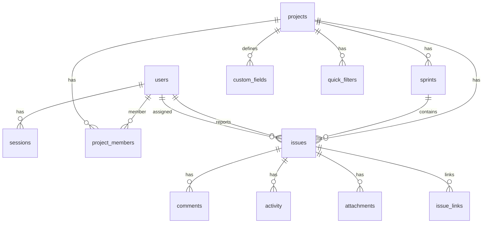

# Jupiter — PostgreSQL data model

Workspace data (projects, issues, sprints, etc.) is stored in **PostgreSQL** via Drizzle ORM when `DATABASE_URL` or Vercel `POSTGRES_URL` is set. The browser still keeps a **Zustand + localStorage** cache for offline dev; production loads and saves through `/api/workspace`.

For deployment diagrams and request flows, see **[ARCHITECTURE.md](./ARCHITECTURE.md)**.

## Entity relationship (core)



## Tables

| Table | Purpose | Maps to client |
|-------|---------|----------------|
| `users` | Auth + workspace members | `Member` / `User` |
| `sessions` | HTTP session cookies | (server only) |
| `auth_tokens` | Email verify / password reset | (server only) |
| `oauth_accounts` | Google Sign-In links | (server only) |
| `projects` | Workspace projects | `Project` |
| `project_members` | Project ↔ user M:N | `Project.memberIds` |
| `sprints` | Scrum sprints | `Sprint` |
| `issues` | Work items | `Issue` |
| `comments` | Issue comments | `Comment` |
| `activity` | Issue audit trail | `ActivityEntry` |
| `attachments` | File metadata + data URL | `Attachment` |
| `custom_fields` | Per-project field defs | `CustomFieldDef` |
| `quick_filters` | Saved board/backlog filters | `QuickFilter` |
| `issue_links` | Directed issue relationships | `IssueLink` |

## Column notes

### `projects`

- `status_overrides` (jsonb) — per-status label, color, board visibility, order.
- `transition_rules` (jsonb) — role → from-status → allowed to-statuses (v1.5 workflow).
- `issue_counter` — last issued number for keys (`WEB-7`).

### `issues`

- `rank` (float) — column ordering on the board.
- `due_date` (text) — `YYYY-MM-DD` for calendar/list views.
- `custom_fields` (jsonb) — values keyed by custom field id.
- `labels` (jsonb) — string array.

### `issue_links`

- Unique on `(type, from_issue_id, to_issue_id)`.
- CHECK prevents self-links.

## v1.8 tables (persistence APIs)

| Table | Purpose |
|-------|---------|
| `notification_reads` | Per-user read state for activity-based notifications |
| `workspace_events` | Project/sprint workspace audit (complements issue `activity`) |
| `burndown_snapshots` | Per-sprint remaining-points time series |

| API | Purpose |
|-----|---------|
| `GET /api/notifications` | Feed + read flags |
| `POST /api/notifications/read` | Mark activity ids read |
| `GET /api/audit` | Paginated audit (`?cursor=&limit=&projectId=…`) |
| `GET|PUT /api/sprints/:id/burndown` | Snapshot history |
| `POST /api/workspace/events` | Record workspace-level events |

See **[v1.8-persistence-requirements.md](./v1.8-persistence-requirements.md)**.

## API

| Method | Path | Description |
|--------|------|-------------|
| `GET` | `/api/workspace` | Full workspace snapshot (authenticated) |
| `PUT` | `/api/workspace` | Upsert snapshot from client stores |
| `POST` | `/api/workspace/seed` | Idempotent demo data (admin only) |

## Local commands

```bash
npm run db:push:host    # apply schema
npm run db:seed:host    # users only
npm run db:seed:workspace:host   # users + demo workspace
```
