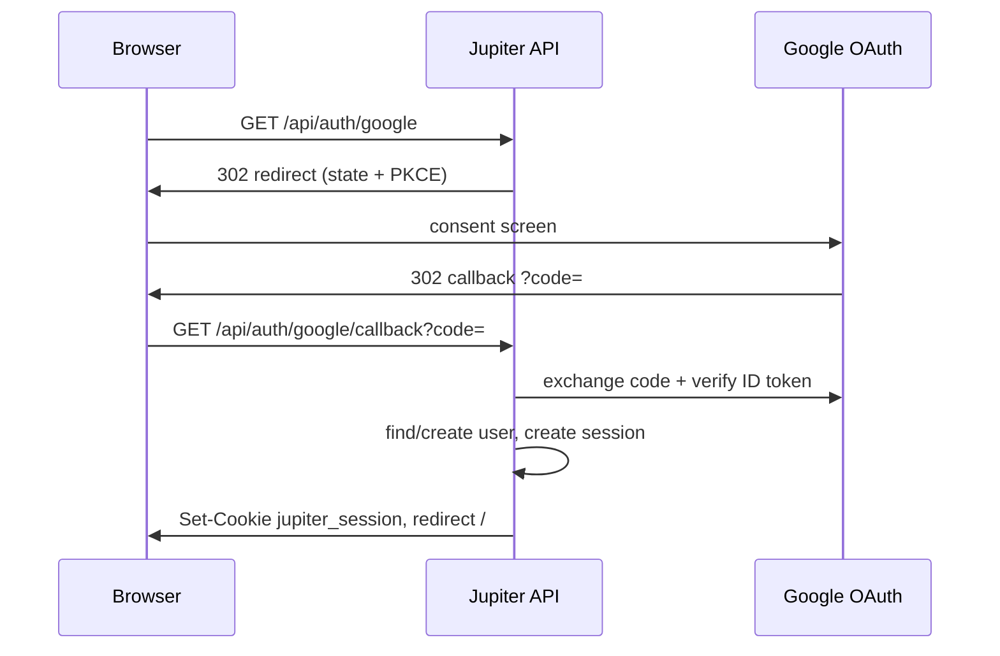

# Jupiter v1.7 — Google Sign-In (web app)

**Status:** Shipped  
**Target:** v1.7.0  
**Depends on:** [v1.6 email authentication](./v1.6-auth-requirements.md) (`users.email`, sessions, verified email model)  
**Reference:** [Google Identity — Sign in with Google for Web](https://developers.google.com/identity/gsi/web/guides/overview), [OAuth 2.0 for Web Server Apps](https://developers.google.com/identity/protocols/oauth2/web-server)

---

## Summary

Integrate **Sign in with Google** into the Jupiter web app so users can authenticate with their Google account instead of (or in addition to) email + password. After Google returns a verified email, Jupiter creates or links a user record and issues the same **HTTP-only session cookie** used by email login.

---

## Goals

1. One-click **“Continue with Google”** on login and sign-up screens.
2. **Server-side OAuth 2.0** (authorization code + PKCE) — secrets never exposed to the browser.
3. **Account linking** by email: Google sign-in attaches to an existing Jupiter user when emails match.
4. Same **roles and route guards** as password users.
5. Works on **localhost**, **OrbStack Docker** (`APP_URL`), and production (Vercel/custom domain).

## Non-goals (v1.7)

- Microsoft / Apple / GitHub social providers (future)
- SAML / enterprise SSO
- Google One Tap only without full OAuth callback (optional stretch)
- Workspace domain restriction (`hd` claim) — stretch for `GOOGLE_ALLOWED_HD`

---

## User stories

| ID | As a… | I want to… | So that… |
|----|--------|------------|----------|
| US-G1 | user | click **Sign in with Google** on the login page | I use my Google account without a new password |
| US-G2 | new user | sign up with Google the first time | an account is created from my Google profile |
| US-G3 | existing user | sign in with Google when I already registered with the same email | I have one account, not duplicates |
| US-G4 | user | sign out | my Jupiter session ends (Google session unaffected) |
| US-G5 | admin | disable Google login via config | we can run email-only in restricted environments |
| US-G6 | developer | test Google OAuth on `localhost:3100` | I can develop without deploying |

---

## Architecture



| Layer | Choice |
|-------|--------|
| Flow | OAuth 2.0 **authorization code** with **PKCE** (`S256`) |
| Session | Existing `sessions` table + `jupiter_session` cookie |
| Client UI | Google Identity Services button **or** custom button → navigates to `/api/auth/google` |
| Token handling | Exchange code server-side; validate `id_token` (iss, aud, exp, email_verified) |

---

## Functional requirements

### FR-G1 — Google Cloud configuration

| ID | Requirement |
|----|-------------|
| FR-G1.1 | Document setup in README: [Google Cloud Console](https://console.cloud.google.com/) → APIs & Services → Credentials → **OAuth 2.0 Client ID** (type **Web application**). |
| FR-G1.2 | Enable **Google+ API** / **Google Identity** (People API not required for basic profile). |
| FR-G1.3 | **Authorized JavaScript origins:** `http://localhost:3100`, production `APP_URL`. |
| FR-G1.4 | **Authorized redirect URIs:** `{APP_URL}/api/auth/google/callback`. |
| FR-G1.5 | Env vars (never commit): `GOOGLE_CLIENT_ID`, `GOOGLE_CLIENT_SECRET`, `APP_URL`. |
| FR-G1.6 | Feature flag: `AUTH_GOOGLE_ENABLED=true` — when false, hide button and return `404` on OAuth routes. |

### FR-G2 — Data model

| ID | Requirement |
|----|-------------|
| FR-G2.1 | New table `oauth_accounts`: `id`, `user_id`, `provider` (`google`), `provider_account_id` (Google `sub`), `email_at_link`, `created_at`. |
| FR-G2.2 | Unique index on `(provider, provider_account_id)`. |
| FR-G2.3 | `users.password_hash` **nullable** — Google-only users have no password until they set one (optional “Add password” in settings, stretch). |
| FR-G2.4 | On first Google sign-in: create `users` row with `email`, `name`, `avatar` from claims; set `email_verified_at` from Google `email_verified`. |
| FR-G2.5 | If `users.email` exists (password account) and Google `sub` not linked: **link** `oauth_accounts` after successful Google auth (same verified email). |
| FR-G2.6 | If `oauth_accounts` exists for `sub`: sign in that `user_id`. |

### FR-G3 — API routes

| ID | Requirement |
|----|-------------|
| FR-G3.1 | `GET /api/auth/google` — generate `state`, `code_verifier` (httpOnly cookies or encrypted state), redirect to Google authorize URL. |
| FR-G3.2 | Scopes: `openid email profile` (minimum). |
| FR-G3.3 | `GET /api/auth/google/callback` — validate `state`, exchange `code`, verify `id_token`. |
| FR-G3.4 | On success: `createSession(userId)`, redirect to `/` (or `redirect` query param allowlist). |
| FR-G3.5 | On error: redirect to `/login?error=google_auth_failed` with safe message (no token details). |
| FR-G3.6 | Rate limit OAuth start/callback routes (same bucket as login). |

### FR-G4 — UI (web app)

| ID | Requirement |
|----|-------------|
| FR-G4.1 | Login and sign-up pages show **“Continue with Google”** below email/password (divider: “or”). |
| FR-G4.2 | Button follows [Google branding guidelines](https://developers.google.com/identity/branding-guidelines) (official asset or approved custom). |
| FR-G4.3 | Loading state while redirecting; handle `?error=` query on login page. |
| FR-G4.4 | Settings (stretch): show “Connected Google account” + disconnect (deletes `oauth_accounts` row; requires password set if no other login method). |

### FR-G5 — Security

| ID | Requirement |
|----|-------------|
| FR-G5.1 | Validate `id_token` with Google JWKS or tokeninfo; check `aud === GOOGLE_CLIENT_ID`, `iss` accounts.google.com. |
| FR-G5.2 | Require `email_verified === true` from Google; reject otherwise. |
| FR-G5.3 | `state` nonce — CSRF protection; single use; 10-minute TTL. |
| FR-G5.4 | PKCE `code_verifier` stored server-side (cookie) until callback. |
| FR-G5.5 | Do not store Google `access_token` long-term unless needed (prefer ID token claims only). |
| FR-G5.6 | Log auth events without PII tokens (user id + provider only). |

### FR-G6 — Docker / environments

| ID | Requirement |
|----|-------------|
| FR-G6.1 | `env.example` documents Google vars; Docker Compose passes through from `.env`. |
| FR-G6.2 | Local: register `http://localhost:3100/api/auth/google/callback` in Google Console. |
| FR-G6.3 | Production: `APP_URL` must match deployed origin exactly (Vercel alias included). |

---

## Environment variables

```bash
# Required when AUTH_GOOGLE_ENABLED=true
GOOGLE_CLIENT_ID=xxxx.apps.googleusercontent.com
GOOGLE_CLIENT_SECRET=xxxx
APP_URL=http://localhost:3100

# Optional
AUTH_GOOGLE_ENABLED=true
# GOOGLE_ALLOWED_HD=yourcompany.com   # restrict to Workspace domain
```

---

## API summary (additions)

| Method | Path | Purpose |
|--------|------|---------|
| GET | `/api/auth/google` | Start OAuth redirect |
| GET | `/api/auth/google/callback` | Complete OAuth, set session |

---

## Acceptance criteria

- [ ] User can sign in with Google on localhost and receive a valid `jupiter_session`.
- [ ] Second sign-in with same Google account reuses same Jupiter user.
- [ ] User with existing email/password account can link Google when emails match.
- [ ] Google-only user has `email_verified_at` set; can access app per role rules.
- [ ] `AUTH_GOOGLE_ENABLED=false` hides button and disables routes.
- [ ] Invalid/expired `state` or `code` fails safely (no session, user-friendly error).
- [ ] No client secret in frontend bundle; `npm run build` passes.

---

## Implementation notes (Next.js 16)

- Use route handlers under `src/app/api/auth/google/` and `callback/route.ts`.
- Prefer small server module `src/server/auth/google.ts` (build authorize URL, exchange code, parse JWT).
- Optional dependency: `openid-client` or hand-rolled fetch to `oauth2.googleapis.com/token`.
- Do **not** use deprecated Google Sign-In JavaScript platform library alone without server verification.

---

## References

- [REQUIREMENTS.md](../REQUIREMENTS.md) — §7 Authentication
- [v1.6 auth spec](./v1.6-auth-requirements.md)
- [tasks/v1.7-google-sign-in-todo.md](../tasks/v1.7-google-sign-in-todo.md)
- Google: [Integrating Google Sign-In into your web app](https://developers.google.com/identity/sign-in/web/sign-in)
